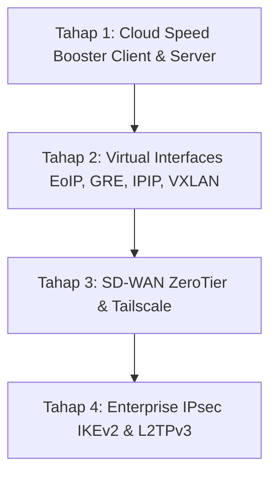

# Roadmap Pengembangan Fitur VPN & Tunneling Interface
**MitraNet Rinjani 1.0.2**

Dokumen ini disusun sebagai acuan kerja terstruktur agar seluruh implementasi berjalan optimal, stabil, dan sesuai standar arsitektur jaringan RouterOS / Linux.

---

## Ringkasan Eksekutif & Struktur Penempatan

| Fitur / Modul | Penempatan Menu WebUI | Karakteristik & Engine Linux |
| :--- | :--- | :--- |
| **Cloud Speed Booster (Client & Server)** | `VPN` -> `Cloud Speed Booster` | Multi-stream WireGuard, TCP BBR, ECMP/PCC, DSCP Bypass |
| **Tunneling Interfaces (EoIP, GRE, IPIP, VXLAN)** | `Interfaces` (Tab Virtual / Tunnel) | Linux Kernel Modules (`ip_gre`, `ipip`, `vxlan`, EoIP tap) |
| **SD-WAN Mesh (ZeroTier & Tailscale)** | `VPN` -> Tab / Sub-menu `SD-WAN` | Daemon `zerotier-one` / `tailscaled`, CGNAT NAT-T bypass |
| **IPsec murni / IKEv2** | `VPN` -> Tab / Sub-menu `IPsec` | strongSwan (`charon`), XFRM Linux Kernel Policies |
| **L2TPv3 (Layer 2 Ethernet)** | `VPN` -> Tab `L2TP Ethernet` | Linux L2TP kernel pseudo-wire subsystem |

---

## Tahapan Implementasi Bertahap

---

### Tahap 1: Cloud Speed Booster (Dual-Role: Client & Server)
*Fokus: Mengembangkan halaman `vpn_booster.php` agar dapat bertindak sebagai Client (Uplink/Aggregator) maupun Server (Hub Concentrator).*

1. **Role Client (Uplink Booster)**:
   - Pengaturan VPS Endpoint IP/Domain & Listen Port.
   - Pilihan jumlah stream paralel (2–8 stream WireGuard).
   - Mode load balancer multi-path (ECMP / PCC / Round-Robin).
   - Pengaturan DSCP tagging (AF41/CS0) & TCP MSS Clamping (1360–1420).
2. **Role Server (Aggregation Hub)**:
   - Toggle aktivasi *Booster Server Mode*.
   - Binding port multi-stream listener (port 51820 s/d 51828).
   - Alokasi IP pool tunnel lokal (misal: `10.66.0.1/24`).
   - Aktivasi akselerasi kernel TCP BBR & IP Forwarding NAT Masquerade.
   - Daftar peer/klien yang sedang terhubung beserta telemetri real-time Rx/Tx.
3. **Persistensi Konfigurasi**:
   - Disimpan secara nyata pada `/etc/mitranet/booster_config.json`.

---

### Tahap 2: Penguatan Menu Interfaces (EoIP, GRE, IPIP, VXLAN)
*Fokus: Mengintegrasikan interface tunnel point-to-point dan overlay layer 2 ke dalam menu Interfaces.*

1. **EoIP (Ethernet over IP - MikroTik Standard)**:
   - Parameter form: `Name`, `Remote Address`, `Tunnel ID`, `MTU` (1500), `MAC Address`, `ARP`.
   - Kemampuan dimasukkan ke dalam Bridge port LAN.
2. **GRE Tunnel (Generic Routing Encapsulation)**:
   - Parameter form: `Name`, `Local Address`, `Remote Address`, `IPsec Secret (Opsional)`, `Keepalive`.
3. **IPIP Tunnel (IP over IP)**:
   - Tunneling ringan layer 3 untuk interkoneksi IP router.
4. **VXLAN (Virtual Extensible LAN)**:
   - Parameter form: `VNI` (VXLAN Network Identifier), `Port` (4789), `Remote VTEP IP`, `Multicast Group`.
5. **UI & Data**:
   - Tombol Toolbar dinamis di menu Interfaces saat memilih tipe interface terkait.
   - Status up/down dan Rx/Tx packets langsung dari kernel Linux (`ip link`, `ip tunnel`).

---

### Tahap 3: Modern SD-WAN Mesh VPN (ZeroTier & Tailscale)
*Fokus: Menghubungkan router MitraNet menembus CGNAT tanpa membutuhkan IP Publik statis.*

1. **ZeroTier Integration**:
   - Input `16-digit Network ID`.
   - Status koneksi: *OFFLINE, REQUESTING_CONFIGURATION, OK*.
   - Status otorisasi (Authorized/Pending) dan IP address virtual yang dialokasikan.
   - Kemampuan auto-join saat boot.
2. **Tailscale Integration**:
   - Input Auth-Key (Reusable / Pre-authenticated key).
   - Toggle *Exit Node* (apakah MitraNet menjadi gateway internet atau hanya node LAN).
   - Status subnet routing (`--advertise-routes`).
3. **UI WinBox**:
   - Modal dialog join network, list peers, dan tombol *Leave / Disconnect*.

---

### Tahap 4: Enterprise IPsec / IKEv2 & L2TPv3 Ethernet
*Fokus: Standar enkripsi korporasi/perbankan dan interkoneksi L2 transparent wire.*

1. **IPsec murni / IKEv2**:
   - **Peers & Identities**: Remote Address, Auth Method (Pre-Shared Key / RSA Certificate), Exchange Mode (IKEv2 / Main).
   - **Proposals & Profiles**: Algoritma enkripsi (AES-GCM, AES-CBC), Hash (SHA256), DH Group (modp2048/ecp256).
   - **Policies**: Source Subnet -> Destination Subnet, Action (Encrypt / Bypass), Tunnel flag.
2. **L2TPv3 (L2TP Ethernet)**:
   - Integrasi penuh di tab `vpn.php?tab=l2tp_ethernet`.
   - Parameter: Session ID, Tunnel ID, Cookie, Local/Remote IP, Bridge membership.

---

## Standar Verifikasi & Deployment Setiap Tahap (Golden Rule)
Setiap penyelesaian pada masing-masing tahap wajib melalui proses:
1. **Verifikasi Sintaks & Backend**: Validasi PHP (`php -l`), struktur JSON/daemon, dan uji fungsional non-dummy.
2. **Sinkronisasi ke Mini PC (`10.10.66.228`)**: Upload file WebUI & script backend, serta restart service WebUI.
3. **Rebuild File ISO**: Jalankan `build_iso.py` dan verifikasi ISO `iso/MitraNet-Rinjani-1.0.2-amd64.iso` ter-generate sukses.
4. **Commit & Push GitHub**: Stage, commit deskriptif, dan push ke branch `main`.
